# 🔐 CalVault — Stealth Based Secure Vault System


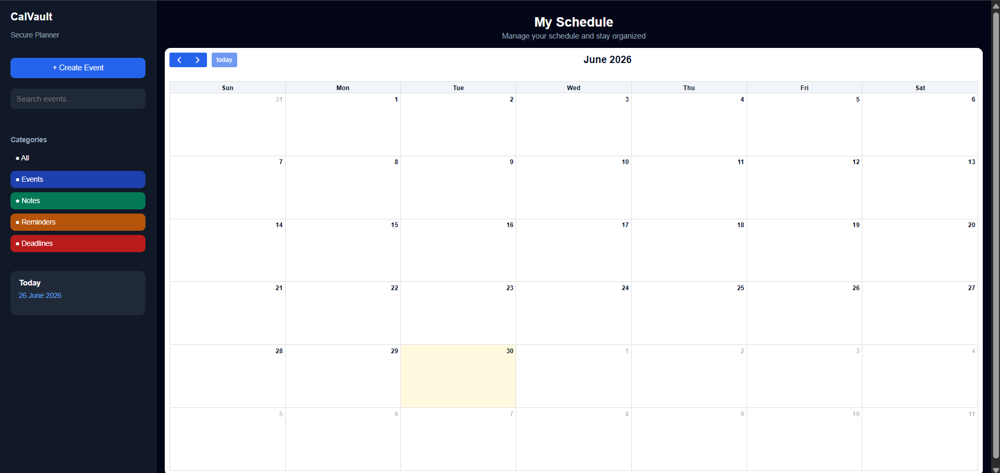

**CalVault** is a privacy-focused secure vault application disguised as a normal planner/calendar application. Unlike traditional password managers or vault systems, CalVault hides sensitive data behind a stealth-based authentication mechanism, ensuring the vault remains invisible to casual observers.

Instead of a visible login system, users access the vault by selecting a secret calendar date pattern followed by vault password verification, creating a multi-layer hidden authentication system.

This project focuses on **security, privacy, stealth authentication, encrypted storage, and secure recovery mechanisms**.

---

## 🚀 Project Overview

Most password managers and secure storage applications are easily recognizable, making them vulnerable to unwanted attention.

CalVault solves this problem by disguising itself as a normal planner application.

To any normal user, the application appears as a regular calendar planner where events and schedules can be managed.

However, authorized users can secretly unlock the hidden vault by entering a predefined secret date pattern on the calendar, followed by vault password authentication.

This stealth-first design adds an additional privacy layer beyond traditional authentication systems.

---

## ❓ Why CalVault?

Traditional password managers and secure vault applications are easily identifiable, making them vulnerable to unwanted attention or forced access.

CalVault was designed with a stealth-first security philosophy.

Instead of exposing sensitive storage behind visible authentication systems, CalVault disguises itself as a harmless planner application.

Only users who know the secret calendar pattern can trigger hidden authentication and access encrypted vault data.

The goal of this project was to explore privacy-centric security design beyond traditional login systems.

---

## 🎯 Core Concept

Normal user sees:

```text
Planner Application
→ Add Events
→ Organize Tasks
→ Manage Schedule
```

Authorized user knows:

```text
Secret Calendar Date Pattern
→ Hidden Vault Authentication Trigger
→ Vault Password Verification
→ Secure Vault Opens
```

Even the recovery system remains hidden and can only be triggered using a secret recovery gesture.

---

## ✨ Key Features

### 📅 Calendar Planner Interface

* Interactive planner/calendar interface
* Add personal events and reminders
* Manage tasks and schedules
* Normal planner appearance for stealth protection

---

### 🔐 Hidden Authentication System

* Secret calendar date pattern unlock
* Hidden vault authentication trigger
* Multi-layer access verification
* Vault remains invisible to unauthorized users

Authentication flow:

```text
Calendar Page
↓
Secret Date Pattern Clicked
↓
Vault Password Authentication
↓
Secure Vault Opens
```

---

### 🔑 Password Vault

* Secure password management system
* Store credentials safely
* Add password entries
* Edit existing passwords
* Delete stored passwords
* Organize passwords by categories
* Passwords stored in encrypted format

---

### 📁 Secure File Vault

* Upload files securely
* Automatic file encryption before storage
* Secure file download
* File preview support
* Delete uploaded files securely
* Supports images, PDFs, and text files

Supported file operations:

```text
Upload
Encrypt
Store Securely
Preview
Download
Delete
```

---

### 🛡 Multi Layer Security Protection

CalVault implements multiple security layers.

#### Layer 1 — Stealth Protection

Application looks like a normal planner.

#### Layer 2 — Hidden Calendar Authentication

Vault unlock requires secret date pattern.

#### Layer 3 — Vault Password Verification

Vault password required after secret pattern.

#### Layer 4 — Encryption Protection

Passwords and uploaded files stored in encrypted form.

#### Layer 5 — Auto Session Lock

Vault automatically locks after inactivity.

#### Layer 6 — Activity Monitoring

Sensitive actions are recorded in security logs.

#### Layer 7 — Recovery Protection

Recovery requires hidden trigger + recovery key verification.

---

### ⏳ Automatic Session Lock

Vault automatically locks when:

* User remains inactive for 5 minutes
* User switches browser tab
* Session expires automatically

This prevents unauthorized access if device is left unattended.

---

### 📜 Security Activity Monitoring

All sensitive actions are recorded.

Activity log tracks:

* Password added
* Password deleted
* File uploaded
* File deleted
* Vault password changed
* Secret pattern changed
* Vault reset performed
* Recovery actions

Provides an audit trail for vault operations.

---

### ♻ Backup & Recovery System

CalVault includes built-in recovery mechanisms.

#### Recovery Key Generation

During initial setup:

```text
Password Created
↓
Secret Pattern Selected
↓
Recovery Key Generated Automatically
```

Example:

```text
CV-A8K2-91PL-X7QM-4TR9
```

---

#### Hidden Recovery Access

Recovery mode remains hidden.

Trigger:

```text
Tap planner title 5 times
↓
Recovery Mode Opens
```

Recovery flow:

```text
Hidden Recovery Trigger
↓
Enter Recovery Key
↓
Verify Recovery Key
↓
Reset Vault Password
↓
Create New Secret Pattern
↓
Access Restored
```

---

### ⚙ Settings Management

Users can securely manage vault settings.

Available options:

* Change Vault Password
* Change Secret Pattern
* Reset Entire Vault
* Delete Account

---

### ⚠ Secure Vault Reset

Vault reset requires password verification.

Process:

```text
Click Reset Vault
↓
Enter Vault Password
↓
Authentication Verification
↓
Delete All Password Data
↓
Delete All File Records
↓
Delete Encrypted Files From Storage
↓
Vault Reset Complete
```

Reset protection prevents accidental or unauthorized deletion.

---

## 🏗 System Architecture

```text
Normal Planner Interface
        ↓
Secret Calendar Pattern Selected
        ↓
Hidden Authentication Trigger
        ↓
Vault Password Verification
        ↓
Encrypted Vault Access
        ↓
Password Vault + File Vault
        ↓
Activity Monitoring + Recovery + Settings
```

---

## 🔒 Security Architecture

CalVault uses layered security architecture.

```text
Stealth UI Layer
        ↓
Secret Pattern Authentication
        ↓
Vault Password Verification
        ↓
Password Encryption
        ↓
File Encryption
        ↓
Session Lock Protection
        ↓
Activity Monitoring
        ↓
Recovery Key Protection
```

---

## 🛠 Technology Stack

### Backend

* Python
* Flask
* SQLite
* Flask-SQLAlchemy

### Frontend

* HTML
* CSS
* JavaScript

### Security & Encryption

* Cryptography (Fernet Encryption)
* Password Hashing (Werkzeug)
* Secure Session Management
* Encrypted File Storage
* Recovery Key Protection

---

## 📂 Project Structure

```text
CalVault/

├── app.py
├── config.py
├── extensions.py
├── requirements.txt
├── .gitignore
├── .env

├── models/
│   ├── activity.py
│   ├── event.py
│   ├── file.py
│   ├── user.py
│   ├── vault.py
│   └── __init__.py

├── routes/
│   ├── auth/
│   │   ├── setup.py
│   │   └── __init__.py
│   │
│   ├── calendar/
│   │   ├── calendar.py
│   │   ├── hidden.py
│   │   └── __init__.py
│   │
│   ├── settings/
│   │   ├── settings.py
│   │   └── __init__.py
│   │
│   └── vault/
│       ├── files.py
│       ├── passwords.py
│       ├── recovery.py
│       ├── vault.py
│       └── __init__.py

├── services/
│   ├── activity_service.py
│   ├── encryption_service.py
│   └── recovery_service.py

├── templates/
│   ├── auth/
│   │   ├── setup.html
│   │   ├── vault_auth.html
│   │   ├── recovery_key.html
│   │   ├── recover_access.html
│   │   ├── reset_access.html
│   │   └── reset_vault.html
│   │
│   ├── calendar/
│   │   └── calendar.html
│   │
│   ├── settings/
│   │   ├── settings.html
│   │   ├── change_password.html
│   │   ├── change_pattern.html
│   │   └── delete_account.html
│   │
│   └── vault/
│       ├── vault.html
│       ├── password_vault.html
│       ├── file_vault.html
│       └── activity_log.html

├── static/
│   ├── css/
│   │   └── style.css
│   │
│   └── js/
│       ├── auto_lock.js
│       ├── calendar.js
│       └── setup.js

├── uploads/
└── instance/
```

---

## 📸 Application Screenshots

### 🛠 Initial Vault Setup

First-time secure setup where the user creates a vault password and selects a secret 4-date calendar unlock pattern.

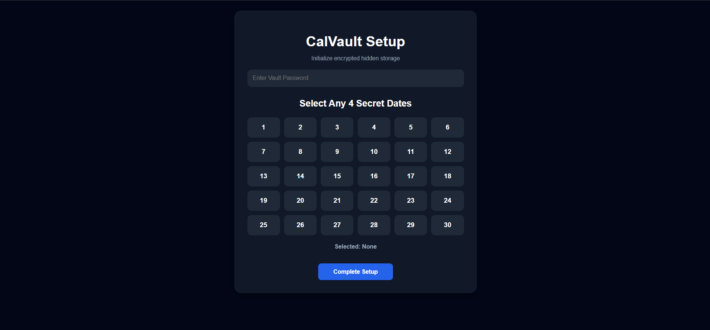

---

### 🔑 Recovery Key Generation

A unique recovery key is automatically generated during setup and acts as the only recovery method if access credentials are forgotten.

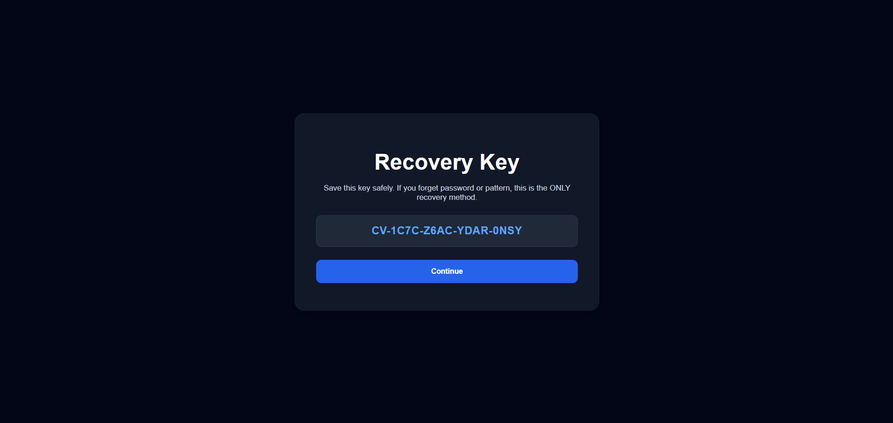

---

### 📅 Planner Interface (Stealth Mode)

A fully functional planner interface used for scheduling events while secretly hiding the encrypted vault behind a normal productivity application.


---

### 🔐 Hidden Vault Authentication

After entering the secret calendar pattern, the hidden authentication page appears requiring vault password verification before granting access.

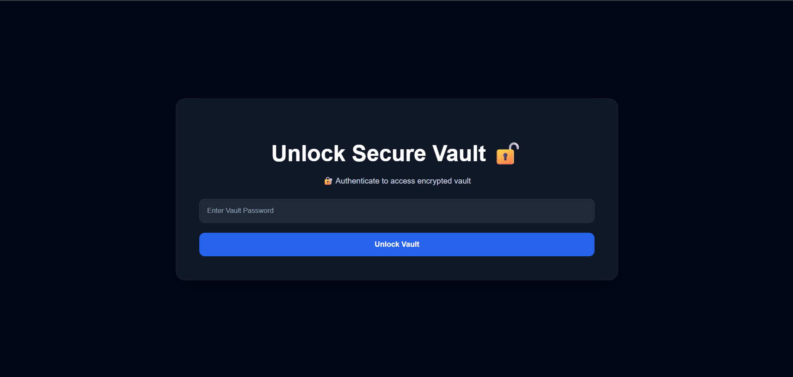

---

### 🏠 Secure Vault Dashboard

Main encrypted vault dashboard displaying password manager, secure file vault, backup options, activity log, settings, and vault destruction controls.

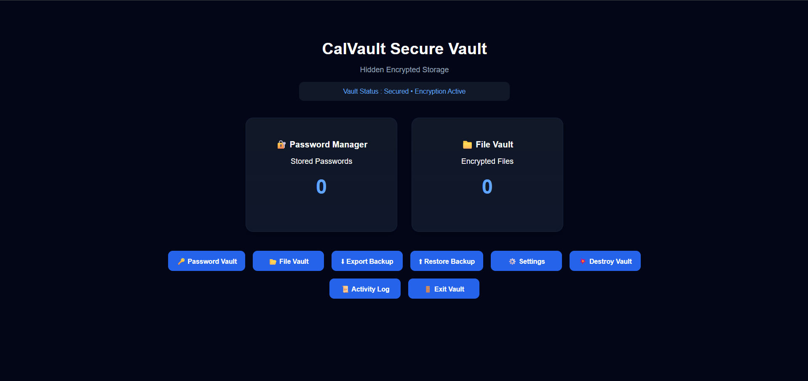

---

### 🔑 Password Vault Manager

Encrypted password management system for securely storing sensitive credentials with search and management functionality.

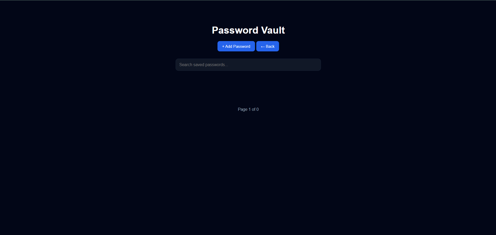

---

### 📁 Secure File Vault

Encrypted file storage system allowing users to securely upload, store, manage, and delete important files inside the hidden vault.

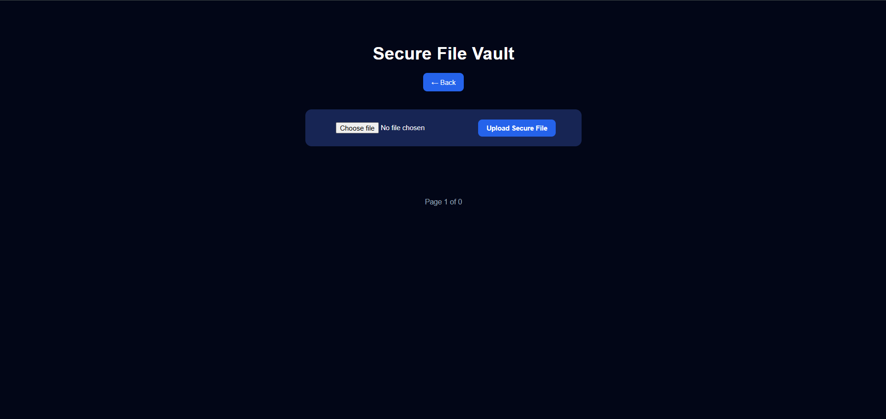

---

### ⚙ Vault Settings Dashboard

Security settings panel allowing users to manage vault password changes, secret pattern updates, and vault reset options.

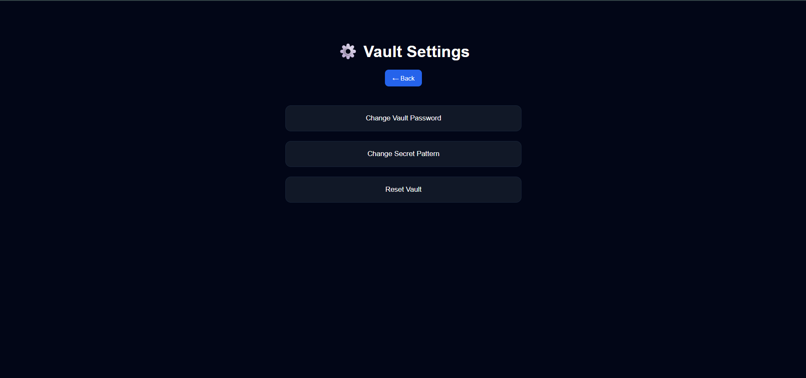

---

### 🔒 Change Vault Password

Users can securely update their existing vault password by verifying the current password before applying changes.

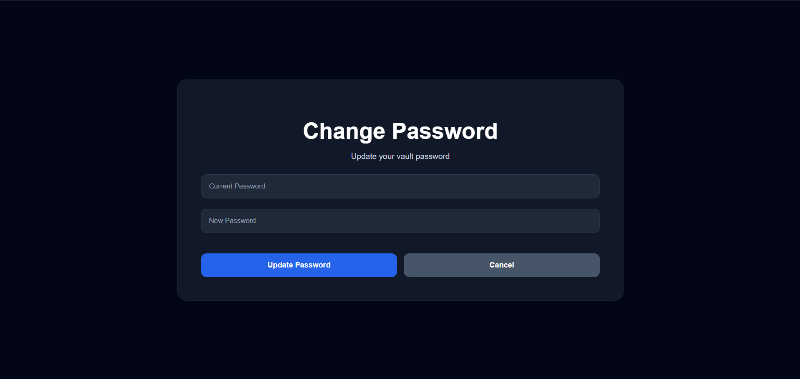

---

### 🔄 Change Secret Pattern

Allows users to update the hidden secret calendar unlock sequence by selecting a new 4-date authentication pattern.

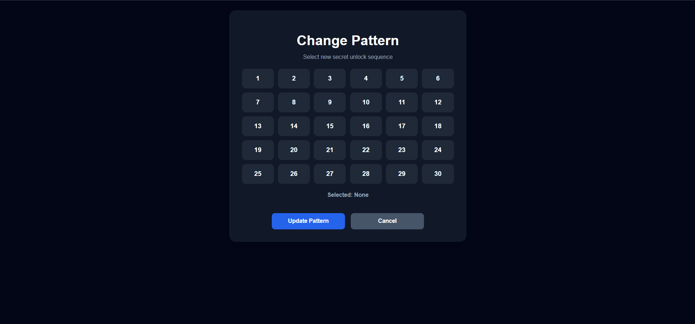

---

### 📜 Security Activity Log

Activity monitoring dashboard that records sensitive security actions such as vault unlocks, file deletion, password changes, and recovery operations.

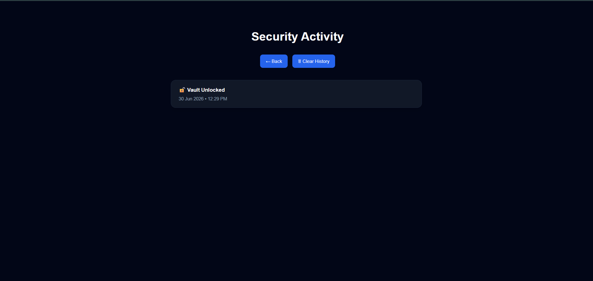

---

### ♻ Hidden Recovery Access System

A secret recovery mechanism that allows users to restore vault access using the generated recovery key when both password and secret pattern are forgotten.

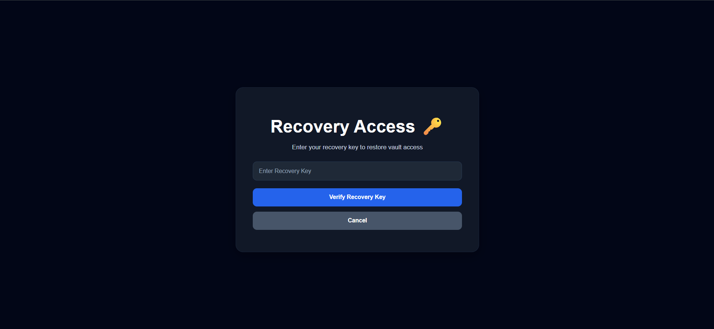

---

### 🔄 Reset Access Recovery System

Users can create a completely new vault password and secret calendar pattern after successful recovery key verification.

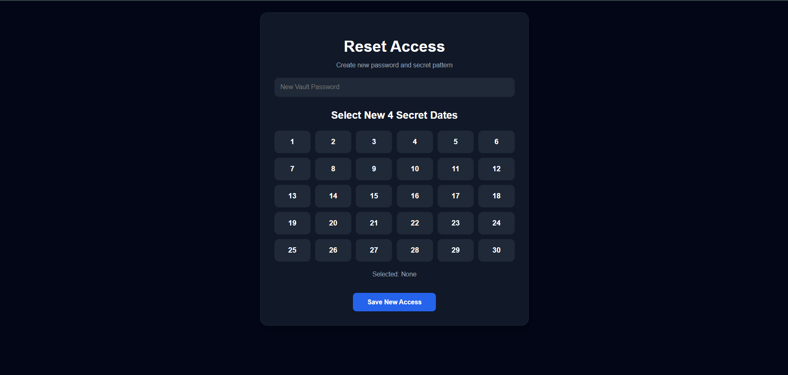

---

### ⚠ Secure Vault Reset Authentication

Before resetting the vault and deleting all encrypted stored data, users must verify their vault password for security confirmation.

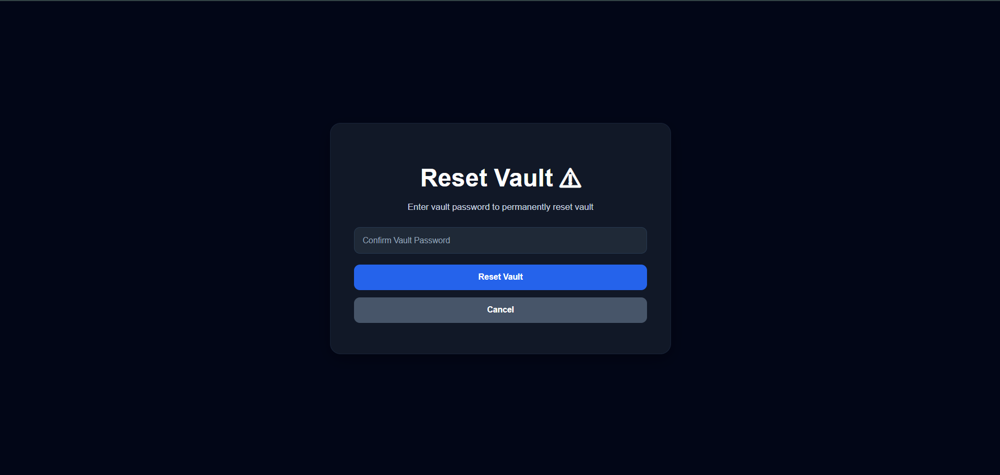

---

### ❌ Permanent Vault Destruction

A secure account destruction system that permanently deletes all stored passwords, encrypted files, backups, and vault data after password confirmation.

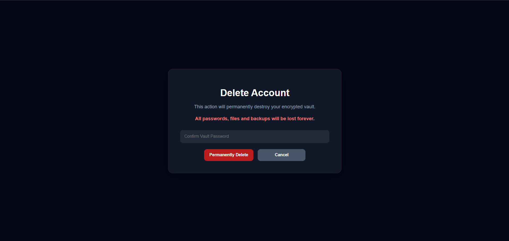

---

## ⚙ Installation

Clone repository

```bash
git clone https://github.com/your-username/calvault-stealth-secure-vault.git
```

Move into project folder

```bash
cd calvault-stealth-secure-vault
```

Install dependencies

```bash
pip install -r requirements.txt
```

Create `.env` file

```env
ENCRYPTION_KEY=your_encryption_key
```

Run application

```bash
python app.py
```

---

## 🔮 Future Improvements

Planned future upgrades:

* Multi-user authentication system
* Cloud encrypted backup storage
* Two-factor authentication
* Mobile responsive interface
* Advanced encrypted database support
* Secure cloud synchronization
* Role based access control

---

## 💡 Project Highlights

* Unique stealth-based authentication system
* Multi-layer security architecture
* Hidden vault disguised as planner application
* Custom secret calendar pattern authentication
* Encrypted password and file storage
* Secure recovery key implementation
* Activity monitoring and audit logging
* Auto session lock security protection
* Built beyond traditional CRUD application architecture

---

## 👨‍💻 Author

**Bhanu Prakash Chintha**

B.Tech — Computer Science Engineering (AI & ML)

🔗 GitHub: [bhanuprakash2508](https://github.com/bhanuprakash2508)

🔗 LinkedIn: [Bhanu Prakash Chintha](https://www.linkedin.com/in/bhanuprakash-chintha/)

---
## Project Status

✅ Development Completed
✅ Security Testing Completed
✅ Encryption Workflow Verified
✅ File Storage Protection Verified
✅ Vault Reset Security Verified

---

This project was developed as a security-focused portfolio project exploring stealth authentication systems, encrypted storage mechanisms, and privacy-first application architecture.

### ⭐ If you found this project interesting, consider giving the repository a star.
